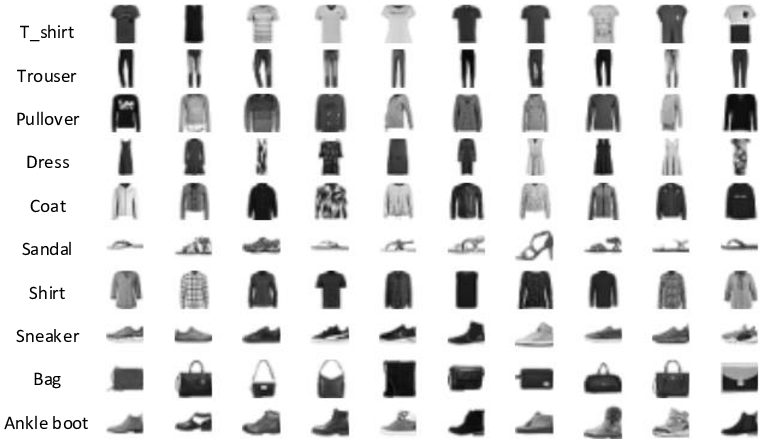

# Lab 2 fashion MNIST

Este notebook es una variacion del proyecto 1 en el cual aplicaremos los mismos modelos que aplicamos pero ahora para un dataset distinto: fashion MNIST

El cual consiste en 70,000 imagenes de prendas de vestir con su etiqueta del tipo de prenda que representan

Seguiremos la misma estructura que en en proyecto 1

1. Read Data (Leer los datos)
2. Data Preprocessing (Preprocesamiento de los datos)
3. Model Creation (Creacion del modelo)
4. Adjust Model with Historic Data (Ajustar el modelo con infromacion historica)
5. Prediction from new Data (Predecir a partir de nueva informacion)
6. Visualization of Results (Visualizar los resultados)

Para correr este notebook es necesario tener: python3, anaconda y tensorflow
